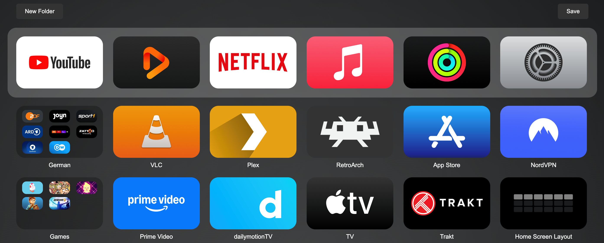

<h1 align="center">Home Screen Layout</h1>

  

Home Screen Layout is a tvOS app that allows you to manage your home screen layout on a jailbroken device through a web interface.

Layout changes will propagate to non-jailbroken devices if the iCloud "One Home Screen" option is enabled.

On tvOS (PineBoard/HeadBoard), there is no exposed API like on iOS (SpringBoard). SpringBoard provides an API (SpringBoardServices) that allows programmatic app arrangement, accessible through tools like Apple Configurator.

## Installation

1. Jailbreak Apple TV using [palera1n](https://palera.in/) (rootful).
2. Download the latest IPA from [releases](../../releases).
3. Install via [Sideloadly](https://sideloadly.io/) or [AltStore](https://altstore.io/).

## Usage

1.	Launch the Home Screen Layout app.
2.	Navigate to the link that is on screen.
3.	Arrange the app and folder icons as desired, then click Save.
4.	If needed, restart PineBoard manually to apply changes.
5.	Move an app to trigger an iCloud sync if necessary.

## License

MIT License.
